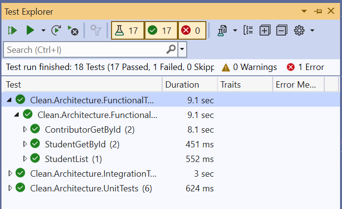

# Ardalis Clean Architecture Implementation
This is the implementation of Clean Architecture by Steve "Ardalis" Smith. Here CRUD operations on a Student Entity is performed. The complete tutorial is provided at - <a href="https://www.yogihosting.com">Implement Ardalis Clean Architecture</a>

# Features
1. ASP.NET Core 8.0 version.
2. CRUD Operations on ASP.NET Core MVC.
3. MVC Views for the UI.
4. Number based Paging implementation for razor view.
5. Authentication and Authorization by Identity.
6. Login, Logout, Register features in Razor Pages.
7. Unit, Integration and Functional Tests.

# Getting Started
1. Simply Download the run the repository. Then go to `/Student/Read` uri to start with the CRUD operations. 
2. For Identity you have to perform migrations. This will create Identity database.
Go to the directory of "Web" project where their is `Clean.Architecture.Web.csproj`. From here run the migration commands.

```sh
dotnet ef migrations add MIGRATIONNAME -c AppIdentityDbContext -p ../Clean.Architecture.Infrastructure/Clean.Architecture.Infrastructure.csproj -s Clean.Architecture.Web.csproj -o Data/Migrations
```

```sh
dotnet ef database update --context AppIdentityDbContext
```

# User Interface
Here we can perform CRUD Operations on a Student Entity.

## Read Records


## Read Records by Paging


## Login & Registration by ASP.NET Core Identity


## Testing



## Support

Your support of every $5 will be a great reward for me to carry on my work. Thank you !

<a href="https://www.buymeacoffee.com/YogYogi" target="_blank"></a>
<a href="https://www.paypal.com/paypalme/yogihosting" target="_blank"></a>
